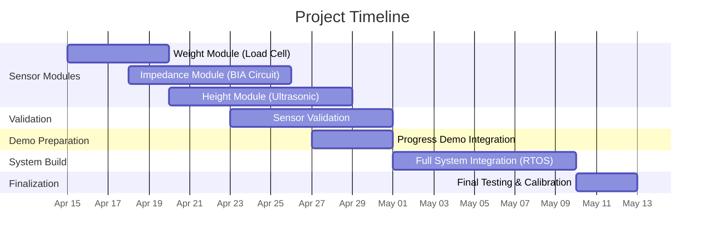

# Body Composition Analyzer

| Name  | GitHub
| ------------- | ------------- |
| Mostafa Elshamy | [MoShamy](https://github.com/MoShamy) |
| Ahmed Elkhodary | [aae121](https://github.com/aae121) |
| Kareem Sayed | [kareems394](https://github.com/kareems394)|

**Github Repo:** https://github.com/MoShamy/Body-Composition

# 1. The Proposal

## Abstract / Elevator Pitch: 

Knowing the composition of your body is essential to understanding your health, and achieving your fitness goals. Most people's home scales do nothing more than telling you your weight, were trying to take this to the next level. Our Body Composition Analyzer seeks to give users a more complete understanding of their body, by determining their Body Fat percentage, Total Body Water, Skeletal Muscle Mass, and other vital metrics for physical health.

Based on the ESP32 Microcontroller, our system will utilise an AC current modulator and sensor (combined with an instrumentation amplifier) to measure bodily impedence, a load cell (and subsequent ADC) to measure weight, and an ultrasonic sensor to measure height. Via a laptop, the user will be able to input their age and sex, and will be displayed the derived metrics, obtained from the measured sensory data points. The program will be running on the ESP32's built in RTOS: FreeRTOS. 

To initiate the process, the user will enter the required information into the laptop, then stand on the scale. Metal electrodes will then be attached to their hands, and the ultrasonic sensor at a distance above. Once measurments are taken, and metrics generated, the GUI will present the values to the user. 

## Project Objectives & Scope: 


### Minimum Viable Product

* Calibrated weight acquisition subsystem utilizing a load cell interfaced through an ADC, ensuring stable and repeatable mass measurements

* Bioelectrical impedance measurement module based on controlled AC excitation and differential voltage sensing via an instrumentation amplifier, enabling extraction of raw impedance values

* Host-assisted user input interface (via laptop) for acquisition of static parameters (age, sex, and manually entered height), reducing on-device sensing complexity

* Embedded computation of Body Fat Percentage using established empirical models, integrating sensor data with user-provided parameters

* Real-time data handling and communication implemented on the ESP32 using FreeRTOS, with task-level separation for sensing, processing, and UART-based data transmission to a host display interface

### Stretch Goals

* Automated height estimation subsystem using an ultrasonic sensor, enabling full on-device anthropometric data acquisition

* Extended body composition analysis including metrics such as Total Body Water, Skeletal Muscle Mass, and BMI through enhanced modeling

* Advanced user interface and data management, including a graphical dashboard and potential logging of historical measurements for trend analysis

# 2. System Architecture

## 2.1 High-Level Block Diagram: 


## Subsystem Breakdown: 
A brief text description of how the major modules (e.g., motor control, user interface, wireless communication) interact.


# 3. Hardware Design

## Component Selection:

## Schematics & Wiring: 
Circuit diagrams, pinout tables, and breadboard layouts.

## Bill of Materials (BOM): 
A table listing component names, part numbers, quantities, costs, and links to datasheets.

## Power Budget: 
Calculations ensuring your power supply can handle the peak current draw of all components combined.

# 4. Software Implementation

## Software Architecture: 
Description of the firmware design (e.g., Bare-metal Superloop, Interrupt-driven, or RTOS).

## Flowcharts & State Machines: 
Visual diagrams mapping out the core logic, state transitions, and interrupt service routines (ISRs).

## Key Algorithms: 

### Goertzel Algorithm (Single-Bin DFT)

The core measurement algorithm for bioelectrical impedance analysis. It extracts the amplitude of a specific frequency component (50 kHz) from digitally sampled ADC data with minimal computational overhead.

**Purpose:** Isolate the 50 kHz AC current response signal from the body impedance measurement, rejecting noise at other frequencies.

**How it works:**
- Uses a recursive feedback resonator with three state variables (q0, q1, q2)
- For each ADC sample, applies: `q0 = coeff·q1 - q2 + x[i]`, then updates q2 and q1
- After processing all samples, computes magnitude: `amplitude = √(real² + imag²)` where:
  - `real = q1 - q2·cos(ω)`
  - `imag = q2·sin(ω)`
  - `ω = 2π·f_target·n / f_sample`

**Why we used it in our Embedded System:**
- O(n) complexity instead of O(n log n) for FFT
- Single-frequency focus eliminates unnecessary computation
- Minimal memory footprint ideal for ESP32 constraints
- Real-time capable with FreeRTOS task timing

**Implementation in project:**
- Processes 1024 ADC samples at 200 kHz sample rate (5.12 ms window)
- Measures impedance at injection frequency (50 kHz)
- Output amplitude directly converts to body impedance via Ohm's law and AD620 instrumentation amplifier gain

### Body Composition Equations

**Deurenberg Single-Frequency BIA Model:**
```
FFM (kg) = -12.44 + 0.34·(H²/Z) + 0.1534·H + 0.273·W - 0.127·A + 4.56·S
```
Where:
- H = height (cm)
- Z = impedance (Ω)
- W = weight (kg)
- A = age (years)
- S = sex (1=male, 0=female)

**Body Fat Percentage:**
```
BF% = (W - FFM) / W × 100
```

Used for converting raw impedance measurement into clinically relevant body composition metrics.

## Development Environment: 
Compilers, IDEs, and toolchains used (e.g., Keil, PlatformIO, STM32CubeIDE).

# 5. Testing, Validation & Debugging

## Unit Testing: 
How individual hardware components and software functions were tested in isolation.

## Integration Testing: 
How the system was tested as a whole.

## Challenges & Solutions: 
A log of major bugs, hardware failures, or design flaws you encountered, and the engineering steps you took to solve them.

# 6. Results & Demonstration

## Final Prototype: 
High-quality photos of the completed build.

## Video Demonstration: 
A link to a short video showing the system working in real-time under various conditions.

## Performance Metrics: 
Data showing how well the project met its initial objectives (e.g., "Response time was measured at 12ms, well within our 50ms goal").

# 7. Project Management

## 7.1 Division of Labor: 

Ahmed:
Analog Front-End
VCCS (current source)
AD620 setup
filters
Electrodes setup
AD5933 integration
Calibration (VERY important)

Mostafa:
ESP32 setup
FreeRTOS
Tasks:
BIA task
Weight task
Height task
Communication (UART to laptop)
Data handling

Kareem:
Load cell + HX711
Ultrasonic sensor
Body composition equations (TBW, FFM, FM, SMM)
Laptop GUI (Python or simple app)
Data visualization


## 7.2 Timeline: 



# 8. Appendices & References

## 8.1 Source Code Repository: 
Link to your GitHub/GitLab repo.

## 8.2 References: 
Links to datasheets, tutorials, academic papers, and course materials used during development.