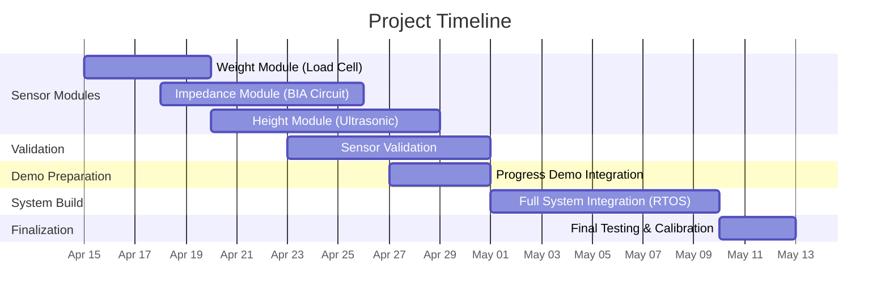

# Body Composition Analyzer

| Name  | GitHub
| ------------- | ------------- |
| Mostafa Elshamy | [MoShamy](https://github.com/MoShamy) |
| Ahmed Elkhodary | [aae121](https://github.com/aae121) |
| Kareem Sayed | [kareems394](https://github.com/kareems394)|

**Github Repo:** https://github.com/MoShamy/Body-Composition

# 1. The Proposal

## Abstract / Elevator Pitch: 

Knowing the composition of your body is essential to understanding your health, and achieving your fitness goals. Most people's home scales do nothing more than telling you your weight, were trying to take this to the next level. Our Body Composition Analyzer seeks to give users a more complete understanding of their body, by determining their Body Fat percentage, Total Body Water, Skeletal Muscle Mass, and other vital metrics for physical health.

Based on the ESP32 Microcontroller, our system will utilise an AC current modulator and sensor (combined with an instrumentation amplifier) to measure bodily impedence, a load cell (and subsequent ADC) to measure weight, and an ultrasonic sensor to measure height. Via a mobile app, using bluetooth, the user will be able to input their age and sex, and will be displayed the derived metrics, obtained from the measured sensory data points. The program will be running on the ESP32's built in RTOS: FreeRTOS. 

To initiate the process, the user will enter the required information into the laptop, then stand on the scale. Metal electrodes will then be attached to their hands, and the ultrasonic sensor at a distance above. Once measurments are taken, and metrics generated, the GUI will present the values to the user. 

## Project Objectives & Scope: 


### Minimum Viable Product

* Calibrated weight acquisition subsystem utilizing a load cell interfaced through an ADC, ensuring stable and repeatable mass measurements

* Bioelectrical impedance measurement module based on controlled AC excitation and differential voltage sensing via an instrumentation amplifier, enabling extraction of raw impedance values

* Host-assisted user input interface (via laptop) for acquisition of static parameters (age, sex, and manually entered height), reducing on-device sensing complexity

* Embedded computation of Body Fat Percentage using established empirical models, integrating sensor data with user-provided parameters

* Real-time data handling and communication implemented on the ESP32 using FreeRTOS, with task-level separation for sensing, processing, and UART-based data transmission to a host display interface

### Stretch Goals

* Automated height estimation subsystem using an ultrasonic sensor, enabling full on-device anthropometric data acquisition

* Extended body composition analysis including metrics such as Total Body Water, Skeletal Muscle Mass, and BMI through enhanced modeling

* Advanced user interface and data management, including a graphical dashboard and potential logging of historical measurements for trend analysis

# 2. System Architecture

## 2.1 High-Level Block Diagram: 


## Subsystem Breakdown: 

|Subsystem|Connection Protocol|Description|
|---|---|---|
|Ultrasonic Sensor| GPIO: TRIG, ECHO |Height measurment module, that measures height by emmiting a high frequency sound, recieving it's echo, and using the intermediate time to determine distance travelled|
|Load Cell| Bit Banging |Measures weight of user|
|Body Impedence Circuit| GPIO: Goertzel's DFT |Measures the bodily impedence by using the MCUs built in ADC and DAC. A low current signal is sent into the body, and the echo measured, filtered and transformed, then used to calculate bodily impedence.|
|Mobile App| Bluetooth| Acts as the user interface for the system. Users enter their Age and Sex, sends a _start_ signal to the MCU (begins measurments), recieves progress/status feedback for a progress bar loading screen, then recieves measurments and metrics, and displays them to the user. |


# 3. Hardware Design

## Component Selection:

## Schematics & Wiring: 
Circuit diagrams, pinout tables, and breadboard layouts.


## Bill of Materials (BOM)
| Component                 |                          Part Number / Model | Quantity | Estimated Cost (2026) | Local Store Link                                                                                                                   | Datasheet                                                                                                                                               |
| ------------------------- | -------------------------------------------: | -------: | --------------------: | ---------------------------------------------------------------------------------------------------------------------------------- | ------------------------------------------------------------------------------------------------------------------------------------------------------- |
| ESP32 Development Board   |      ESP32 30-pin WiFi + Bluetooth Dev Board |        1 |               260 EGP | [Future Electronics Egypt](https://store.fut-electronics.com/products/esp-32)                                                      | [ESP32-WROOM-32 Datasheet](https://www.espressif.com/sites/default/files/documentation/esp32-wroom-32_datasheet_en.pdf)                                 |
| Operational Amplifier     | LM358P (Original) Dual Operational Amplifier |        1 |                10 EGP | [RAM Electronics](https://www.ram-e-shop.com/shop/lm358-original-lm358p-original-5922)                                             | [LM358P Datasheet](https://www.ti.com/lit/ds/symlink/lm358.pdf)                                                                                         |
| Load Cell                 |                 100kg Strain Gauge Load Cell |        1 |               750 EGP | [RAM Electronics](https://www.ram-e-shop.com/shop/kit-load-cell-100kg-load-cell-100kg-weight-sensor-strain-gauge-7305)             | [100kg Load Cell Datasheet](https://cdn.sparkfun.com/datasheets/Sensors/ForceFlex/loadcell.pdf)                                                         |
| HX711 Load Cell ADC       |                      HX711 24-bit ADC Module |        1 |                75 EGP | [RAM Electronics](https://www.ram-e-shop.com/shop/kit-hx711-adc-hx711-weight-scale-analog-to-digital-converter-adc-24-bit-7087)    | [HX711 Datasheet](https://cdn.sparkfun.com/datasheets/Sensors/ForceFlex/hx711_english.pdf)                                                              |
| Instrumentation Amplifier |                                      AD620AN |        1 |               160 EGP | [Future Electronics Egypt](https://store.fut-electronics.com/products/ad620an-low-power-instrumentation-amplifier)                 | [AD620AN Datasheet](https://www.analog.com/media/en/technical-documentation/data-sheets/ad620.pdf)                                                      |
| Ultrasonic Sensor         |             HC-SR04 Ultrasonic Sensor Module |        1 |                55 EGP | [Future Electronics Egypt](https://store.fut-electronics.com/products/ultrasonic-sensor-module)                                    | [HC-SR04 Datasheet](https://cdn.sparkfun.com/datasheets/Sensors/Proximity/HCSR04.pdf)                                                                   |
| ECG Electrodes            |            Ag/AgCl Disposable ECG Electrodes |        3 |          30 EGP total | [Future Electronics Egypt](https://store.fut-electronics.com/products/ecg-electrode)                                               |                                                                 |
| Breadboard                |                           840-pin Breadboard |        1 |                35 EGP | [RAM Electronics](https://www.ram-e-shop.com/shop/bb01-bread-board-bb-01-breadboard-830-tie-point-6143)                            |                                                                                |
| Resistors                 |                       Carbon Resistance 1/4W |  Several |                10 EGP | [Future Electronics Egypt](https://www.ram-e-shop.com/shop/carbon-resistance-1-4w-price-per-4-resistors-9506?category=75#attr=301) | [Generic Carbon Film Resistor Datasheet](https://www.yageo.com/upload/media/product/app/datasheet/lr_series_51.pdf)                                     |
| Capacitors                |        100nF Ceramic/electrolytic capacitors |        2 |                 1 EGP | [RAM Electronics](https://www.ram-e-shop.com/shop/c-pf-104-ceramic-capacitor-pf104-100nf-25v-6240)                                 | [100nF Ceramic Capacitor Datasheet](https://product.tdk.com/system/files/dam/doc/product/capacitor/ceramic/mlcc/catalog/mlcc_commercial_general_en.pdf) |


Estimated Total ≃ **2,000 EGP**

## Power Budget: 

Peak Current required per part:
| Part | Est. Peak Current Drawn (mA) |
|-|-|
ESP32 Dev Board | 240 
LM358P| 1.5
100kg Load Cell| 3
HX711| 1.5
AD620AN| 1.3
HC-SR04| 15
Total| 262.3

Considering possible fluctuations, it would be sensible to round up to 300mA.

At an input of 5v, this would require **1.5 Watts of instantaneous power**.

# 4. Software Implementation

## Software Architecture: 

This project runs on FreeRTOS (native to ESP).

**Task structure:**
- `app_main()` initializes the sensors, BLE stack, and measurement manager
- `ble_service_init()` brings up NimBLE, configures the GATT service, and starts advertising
- `ble_host_task()` runs the NimBLE event loop
- `measurement_manager` waits for a BLE start command and runs the weight, height, and BIA cycle

**BLE control plane:**
- Device name: `BodyComp`
- Primary service UUID: `12345678-1234-5678-1234-567812345678`
- Characteristics:
  - User Profile: read/write age and sex
  - Measurement Start: write `0x01` to trigger a measurement
  - Status: read/notify state, error code, and progress
  - Result: read/notify weight, height, impedance, body fat percentage, and FFM

## User Flowcharts: 
<div align="center">
  
</div>

## Key Algorithms: 

### Goertzel Algorithm (Single-Bin DFT)

The core measurement algorithm for bioelectrical impedance analysis. It extracts the amplitude of a specific frequency component (50 kHz) from digitally sampled ADC data with minimal computational overhead.

**Purpose:** Isolate the 50 kHz AC current response signal from the body impedance measurement, rejecting noise at other frequencies.

**How it works:**
- Uses a recursive feedback resonator with three state variables (q0, q1, q2)
- For each ADC sample, applies: `q0 = coeff·q1 - q2 + x[i]`, then updates q2 and q1
- After processing all samples, computes magnitude: `amplitude = √(real² + imag²)` where:
  - `real = q1 - q2·cos(ω)`
  - `imag = q2·sin(ω)`
  - `ω = 2π·f_target·n / f_sample`

**Why we used it in our Embedded System:**
- O(n) complexity instead of O(n log n) for FFT
- Single-frequency focus eliminates unnecessary computation
- Minimal memory footprint ideal for ESP32 constraints
- Real-time capable with FreeRTOS task timing

**Implementation in project:**
- Processes 1024 ADC samples at 200 kHz sample rate (5.12 ms window)
- Measures impedance at injection frequency (50 kHz)
- Output amplitude directly converts to body impedance via Ohm's law and AD620 instrumentation amplifier gain

### Body Composition Equations

**Deurenberg Single-Frequency BIA Model:**
```
FFM (kg) = -12.44 + 0.34·(H²/Z) + 0.1534·H + 0.273·W - 0.127·A + 4.56·S
```
Where:
- H = height (cm)
- Z = impedance (Ω)
- W = weight (kg)
- A = age (years)
- S = sex (1=male, 0=female)

**Body Fat Percentage:**
```
BF% = (W - FFM) / W × 100
```

**Skeletal Muscle Mass (SMM):**
```text
SMM (kg) = ((height² / R) × 0.401) + (sex × 3.825) - (age × 0.071) + 5.102
```
**Total Body Water (TBW) — Watson Formula:**
```text
Male:   TBW = 2.447 - (0.09516 × age) + (0.1074 × height) + (0.3362 × weight)

Female: TBW = -2.097 + (0.1069 × height) + (0.2466 × weight)
```

> Watson PE, Watson ID, Batt RD. *Total body water volumes for adult males and females estimated from simple anthropometric measurements.* American Journal of Clinical Nutrition, 1980.

**Basal Metabolic Rate (BMR) — Mifflin-St Jeor Equation:**
```text
Male:   BMR = (10 × weight) + (6.25 × height) - (5 × age) + 5

Female: BMR = (10 × weight) + (6.25 × height) - (5 × age) - 161
```

> Janssen I, Heymsfield SB, Baumgartner RN, Ross R. *Estimation of skeletal muscle mass by bioelectrical impedance analysis.* Journal of Applied Physiology, 2000.

Used for converting raw impedance measurement into clinically relevant body composition metrics.


## Development Environment: 
ESP-IDF 6.1.0, ESP32 toolchain, FreeRTOS, and NimBLE BLE stack. Development and validation were done from VS Code with the ESP-IDF extension, and iPhone-side testing used nRF Connect as the BLE client. Mobile app development using Flutter & Dart.

# 5. Testing, Validation & Debugging

## Unit Testing: 
How individual hardware components and software functions were tested in isolation.

## Integration Testing: 
How the system was tested as a whole.

The current integration path is BLE-first: the ESP32 advertises as BodyComp, an iPhone connects through nRF Connect, the app writes age and sex, and the firmware triggers the measurement manager task to collect weight, height, and BIA in a single cycle. Status and result data are exposed as BLE notifications so the full demo can run without a custom mobile app.

## Challenges & Solutions: 
A log of major bugs, hardware failures, or design flaws you encountered, and the engineering steps you took to solve them.

Notable issues resolved during this session:
- NimBLE initialization order caused a LoadProhibited panic when GAP/GATT services were initialized before `nimble_port_init()`.
- 128-bit UUIDs appeared reversed in the scanner until the NimBLE byte order was corrected.
- The device name was added to advertising so the phone could clearly identify the correct ESP32.

# 6. Results & Demonstration

## Final Prototype: 
High-quality photos of the completed build.

## Video Demonstration: 
A link to a short video showing the system working in real-time under various conditions.

## Performance Metrics: 
Data showing how well the project met its initial objectives (e.g., "Response time was measured at 12ms, well within our 50ms goal").

# 7. Project Management

## 7.1 Division of Labor: 

Ahmed:
Analog Front-End
VCCS (current source)
AD620 setup
filters
Electrodes setup
AD5933 integration
Calibration (VERY important)

Mostafa:
ESP32 setup
FreeRTOS
Tasks:
BIA task
Weight task
Height task
Communication (UART to laptop)
Data handling

Kareem:
Load cell + HX711
Ultrasonic sensor
Body composition equations (TBW, FFM, FM, SMM)
Laptop GUI (Python or simple app)
Data visualization


## 7.2 Timeline: 



# 8. Appendices & References

## 8.1 Source Code Repository: 
[Repo Link](https://github.com/MoShamy/Body-Composition)
## 8.2 References: 
Links to datasheets, tutorials, academic papers, and course materials used during development.